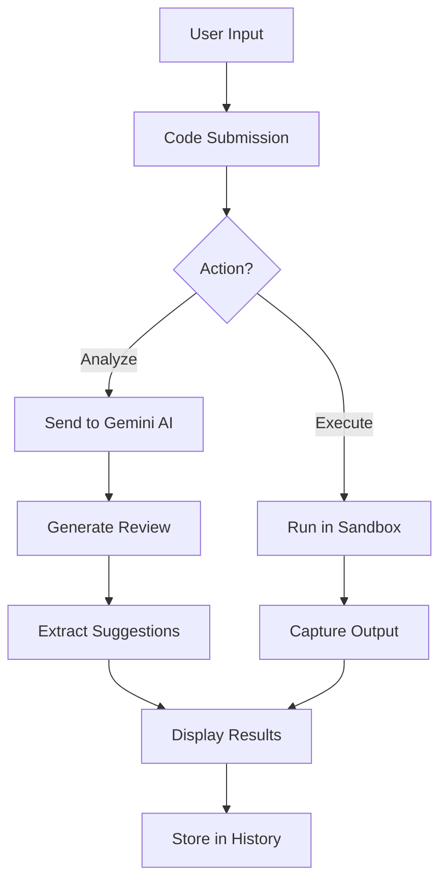

# 🤖 AI Code Review Agent

 *(Sample banner - replace with your own)*

## 🌟 Overview

The **AI Code Review Agent** is an intelligent Streamlit web application that provides instant code analysis, improvement suggestions, and execution capabilities for Python code. Powered by Google's Gemini AI, it helps developers write better code through automated reviews focusing on correctness, performance, readability, and security.

## 🚀 Key Features

- **AI-Powered Code Analysis**: In-depth review of Python code by Gemini 1.5 Flash
- **Smart Suggestions**: Automatic fixes and improvements
- **Code Execution**: Safe in-browser code execution with output capture
- **Version History**: Track all your submissions and reviews
- **One-Click Fixes**: Apply suggested improvements instantly
- **Modern UI**: Sleek dark theme with gradient accents

## 🛠️ Technology Stack

| Component          | Technology |
|--------------------|------------|
| Frontend           | Streamlit |
| AI Model           | Google Gemini 1.5 Flash |
| Code Execution     | Python AST + Sandboxed Execution |
| Styling           | Custom CSS |
| Deployment        | Streamlit Cloud (or any Python hosting) |

## 🧠 AI Model Implementation

The system uses Google's **Gemini 1.5 Flash** model with:

- **Temperature**: 0.3 (for focused, deterministic responses)
- **Max Tokens**: 2000 (for comprehensive reviews)
- **Prompt Engineering**: Structured instructions for consistent output format

### Example AI Instruction:
```python
"""
You are a senior Python developer. Review the following code thoroughly.
Then suggest fixes for bugs, improvements, and best practices.

Focus on:
- Correctness
- Performance
- Readability
- Security

Return markdown output with clear sections:
1. Summary
2. Issues Found
3. Suggestions
4. Suggested Fixed Code (as a code block)
"""
```

## 🔄 Workflow Diagram



## 🖥️ User Interface

### Main Components:
1. **Code Editor**: Text area for Python code input
2. **Action Buttons**:
   - 🔍 Analyze: Get AI review
   - ▶️ Run: Execute code
   - 🧹 Clear: Reset editor
3. **Results Panel**:
   - 📝 AI Review: Detailed analysis in markdown
   - 🖥️ Execution: Output and variables
4. **History Sidebar**: Track all submissions

## 🛡️ Safety Features

- **Code Length Limit**: 2000 characters max
- **AST Validation**: Parses code before execution
- **Sandboxed Execution**: Limited scope with no system access
- **Error Handling**: Comprehensive exception capture

## 🚀 Getting Started

### Prerequisites
- Python 3.8+
- Streamlit
- Google Generative AI package

### Installation
```bash
git clone https://github.com/yourusername/ai-code-review-agent.git
cd ai-code-review-agent
pip install -r requirements.txt
```

### Configuration
1. Get Gemini API key from [Google AI Studio](https://aistudio.google.com/)
2. Create `secrets.toml` in `.streamlit` folder:
```toml
[gemini]
api_key = "your-api-key-here"
```

### Running Locally
```bash
streamlit run app.py
```

## 📈 Future Enhancements

- [ ] Support for multiple languages
- [ ] Integration with GitHub/GitLab
- [ ] Team collaboration features
- [ ] Performance benchmarking
- [ ] Custom prompt templates

## 🤝 Contributing

1. Fork the repository
2. Create your feature branch (`git checkout -b feature/AmazingFeature`)
3. Commit your changes (`git commit -m 'Add some amazing feature'`)
4. Push to the branch (`git push origin feature/AmazingFeature`)
5. Open a Pull Request

## 📜 License

Distributed under the MIT License. See `LICENSE` for more information.

## ✉️ Contact

Your Name - [@yourtwitter](https://twitter.com/yourtwitter) - your.email@example.com

Project Link: [https://github.com/yourusername/ai-code-review-agent](https://github.com/yourusername/ai-code-review-agent)
```

